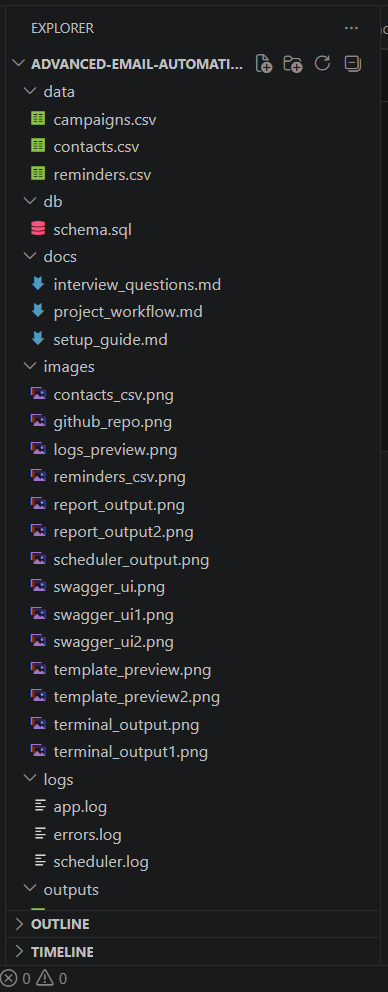
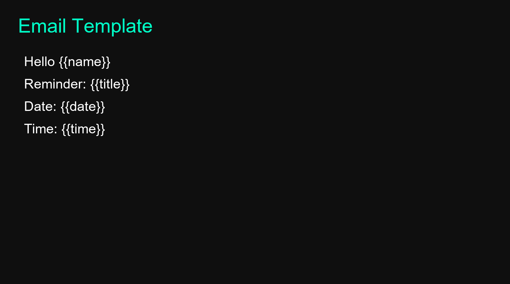
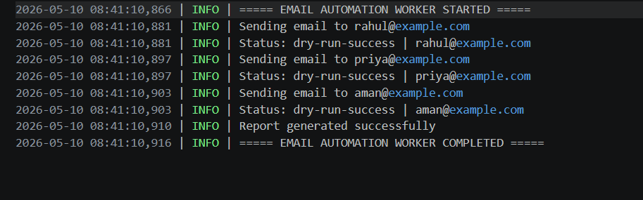
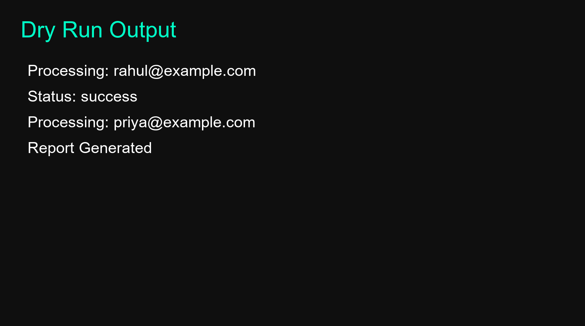
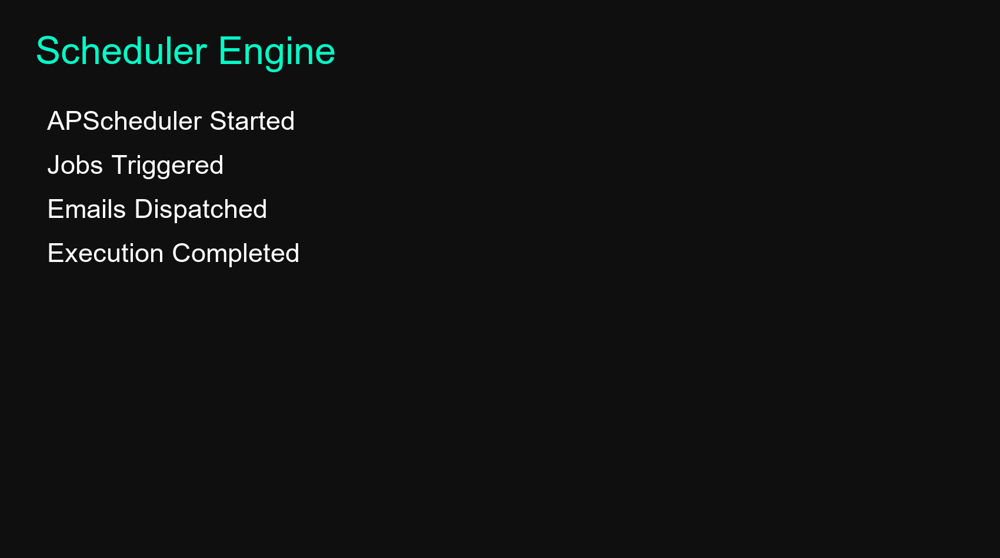
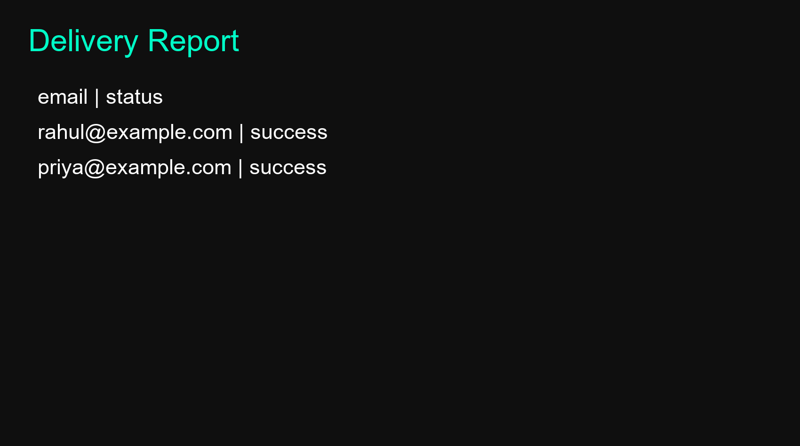
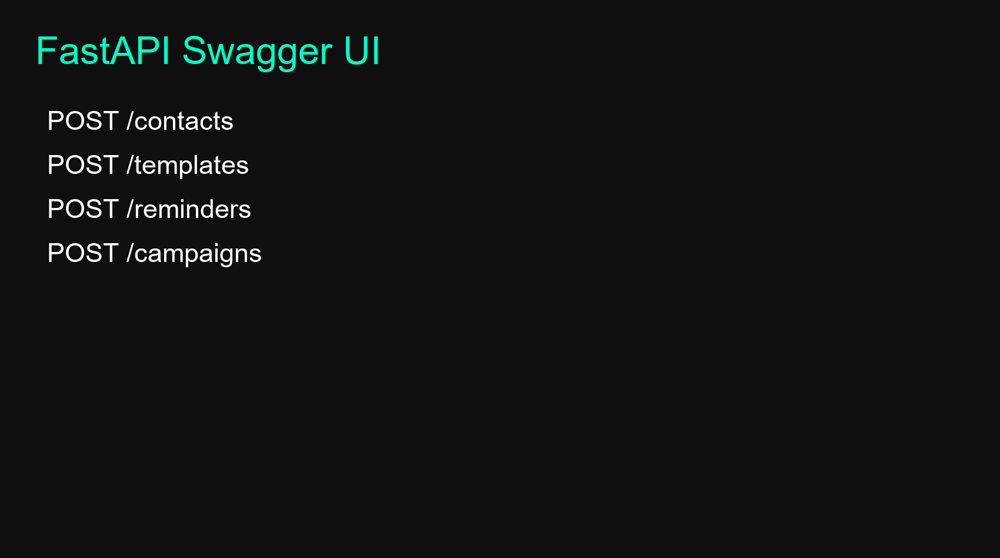
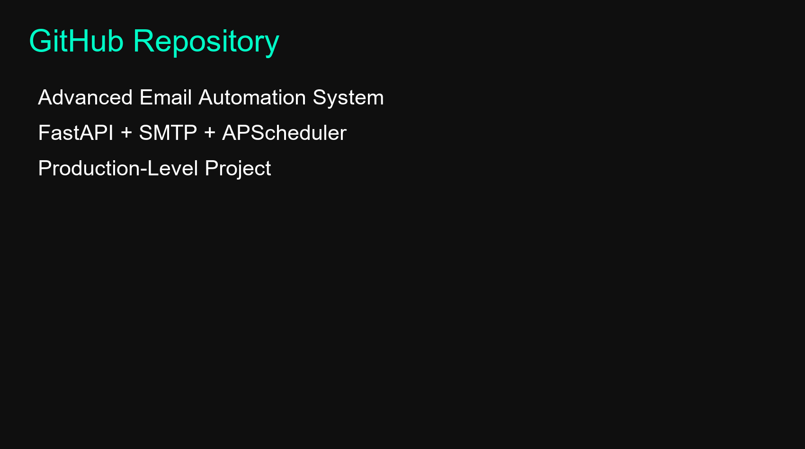

# 🚀 Email Automation & Reminder System

A production-style Python backend system that automates email scheduling, reminders, delivery tracking, logging, and reporting — simulating real-world SaaS automation workflows used in HR systems, EdTech platforms, and enterprise communication tools.

---

## 🏆 Premium Badges

---

## 🔥 Project Overview

The Email Automation & Reminder System is a backend automation engine designed to eliminate manual follow-ups by fully automating email workflows.

It is used in:
- HR onboarding & reminders  
- EdTech class notifications  
- SaaS onboarding emails  
- Payment reminder systems  
- Task and deadline automation  

This system handles:
✔ Email creation  
✔ Scheduling  
✔ Sending  
✔ Tracking  
✔ Logging  
✔ Reporting  

---

## 🧠 Key Features

✔ CSV-based contact & reminder ingestion  
✔ Dynamic email templating (Jinja-style placeholders)  
✔ Scheduled automation using APScheduler  
✔ SMTP email sending engine  
✔ Dry-run mode (safe testing)  
✔ Structured logging system (audit trail)  
✔ Delivery report generation (CSV output)  
✔ Failure tracking  
✔ Auto-generated system visualization images  

---

## 🏗️ System Architecture

CSV Data → Worker Engine → Template Renderer → SMTP Mailer → Logging System → Report Generator

---

## ⚙️ Tech Stack

Python 3.11 • FastAPI • Pandas • SMTP • APScheduler • Jinja2 • Logging • Pillow

---

## 📁 Project Structure

Email-Automation-Reminder-System/
│
├── src/
├── templates/
├── data/
├── logs/
├── outputs/
├── images/
├── main.py
├── generate_images.py
├── requirements.txt
└── README.md

---

## 🖼️ System Outputs

### Project Structure

### Email Template

### Logs Output

### Terminal Execution

### Scheduler Engine

### Delivery Report

### Swagger UI

### GitHub Repository

---

## ⚙️ Installation & Setup

### 1. Clone Repository
git clone https://github.com/vyawaha/advanced-email-automation-reminder-system.git
cd email-automation-system

---

### 2. Create Virtual Environment
python -m venv venv
venv\Scripts\activate

---

### 3. Install Dependencies
pip install -r requirements.txt

---

### 4. Run System
python main.py

---

### 5. Generate Images
python generate_images.py

---

## 📊 Sample Output

Processing: rahul@example.com  
Status: SUCCESS  
Processing: priya@example.com  
Status: SUCCESS  
Report Generated Successfully  

---

## 📈 Learning Outcomes

✔ Backend automation architecture  
✔ Email workflow systems (SMTP)  
✔ Scheduler-based execution  
✔ Logging & observability design  
✔ Production-style Python project structuring  

---

## 🚀 Future Improvements

- Celery + Redis distributed workers  
- PostgreSQL migration  
- Real-time dashboard UI  
- Email analytics system  
- Multi-tenant SaaS architecture  
- Docker deployment  

---

## 👨‍💻 Author

Built as a production-style backend automation project for internships, GitHub portfolio, and system design practice.

---

⭐ If you like this project, give it a star and connect with me for more backend + automation systems.